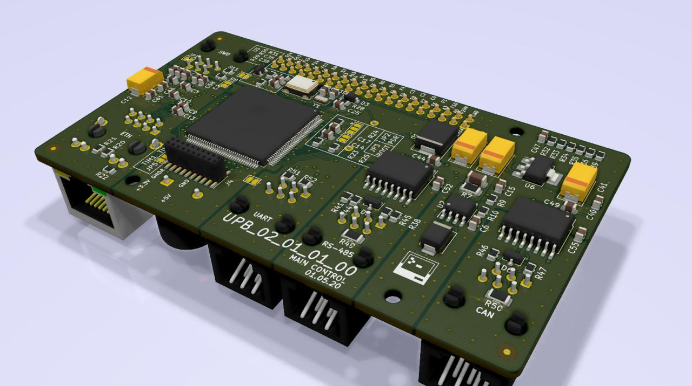
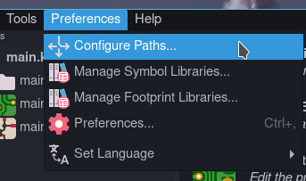
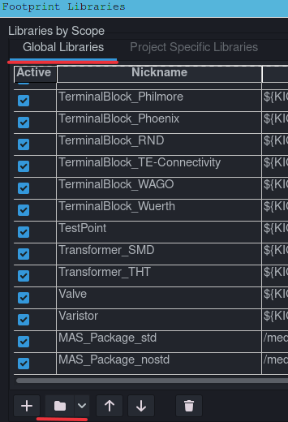
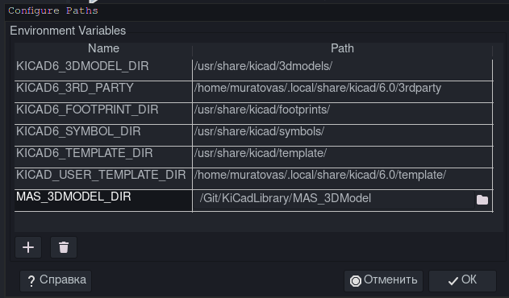

# Библиотека компонентов для KiCad
Данная библиотека используется автором для работы, постоянно пополняется новыми компонентами. Посадочные места для компонентов выполнены в полном соответствии с группой стандартов `IPC` и рекомендациям производителя. 

Структура библиотеки:

- `*.kicad_sym` - библиотека УГО компонентов
- `MAS_Package_std.pretty` - посадочные места для стандартных корпусов. Например, LQFP-48 и подобные
- `MAS_Package_nostd.pretty` - посадочные места для нестандартных компонентов, например, ZMPT107-1

## Установка:

Скачайте архив или клонируем репозиторий на локальный диск:

~~~ bash
git clone https://github.com/MuratovAS/KiCadLibrary
~~~

Для установки библиотеки откройте KiCad и перейдите в подпункт настроек:

Жмакаем на указанные кнопки и добавляем все файлы `*.kicad_sym`.

Подобную операцию проворачиваем для библиотеки посадочных мест, только нашей целью будут каталоги `MAS_Package_std.pretty`, `MAS_Package_nostd.pretty`.

В заключение подключим 3D модули. 
Создаем переменную `MAS_3DMODEL_DIR`, пропишем путь к каталогу `MAS_3DModel`.

## Требования к добавляемым компонентам

Все элементы должны быть отрисованы по образу и подобию стандартной библиотеки. 

FP (ФП):
- Все стандартные поля должны быть заполнены
    + Имя/значение
    + Описание
    + Ключевые слова
    + Тип компонента
    + 3D модуль (используй env.: `${MAS_3DMODEL_DIR}/.........step`)
    + Спец поля (при необходимости)
- Требуется чертеж
    + Cu (проводящий слой)
    + Fab (условное обозначение для сборочного чертежа)
    + SilkScreen (обозначение)
    + Mask (в особых случаях)
    + Cuts (в особых случаях, стараться не использовать)
    + Courtyard (граница компонента, брать с небольшим запасом)
- Геометрический центр компонента должен совпадать с центром чертежа FP
- По возможности указывать осмысленные имена (см. faq/Именуем правильно)
    + Идея пере использования, если компонент встречается у нескольких производителей, не указывать его в имени. 
    + Использовать `-` в качестве разделителя имени. Для разделения параметров использовать `_`. Пример: `QFN-88-1EP_10x10mm_P0.4mm`
    + В качестве незначимого символа использовать `x`. Пример: `1EDCxxx12AH`

CGD (УГО):
- Все стандартные поля должны быть заполнены
    + Имя/значение
    + Описание
    + Ключевые слова
    + FP
    + Datasheet

## Заметки:

Q: Как настроить правила проектирования под технологические возможности jlc?

A: Воспользуйся [MuratovAS/KiCAD-Custom-DRC-Rules](https://github.com/MuratovAS/KiCAD-Custom-DRC-Rules-for-JLCPCB-with-Unit-Tests). Стоит отметить что `main.kicad_dru` не может реализовать все правила, по этому приходиться использовать несколько стандартных правил
