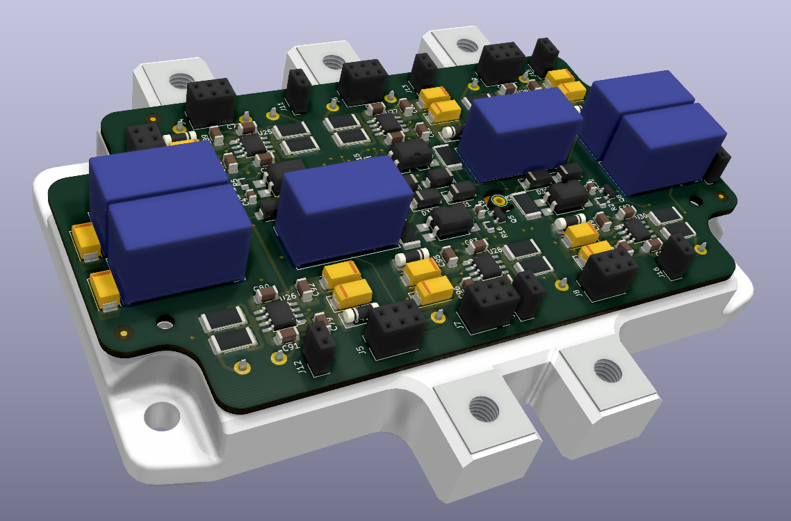
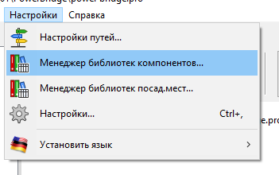
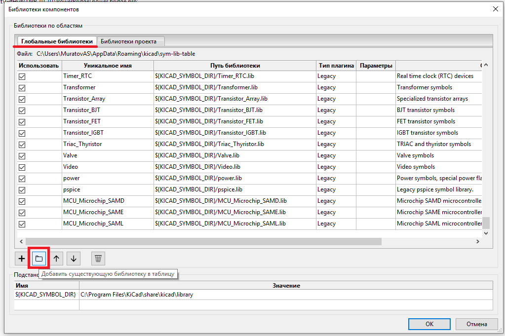
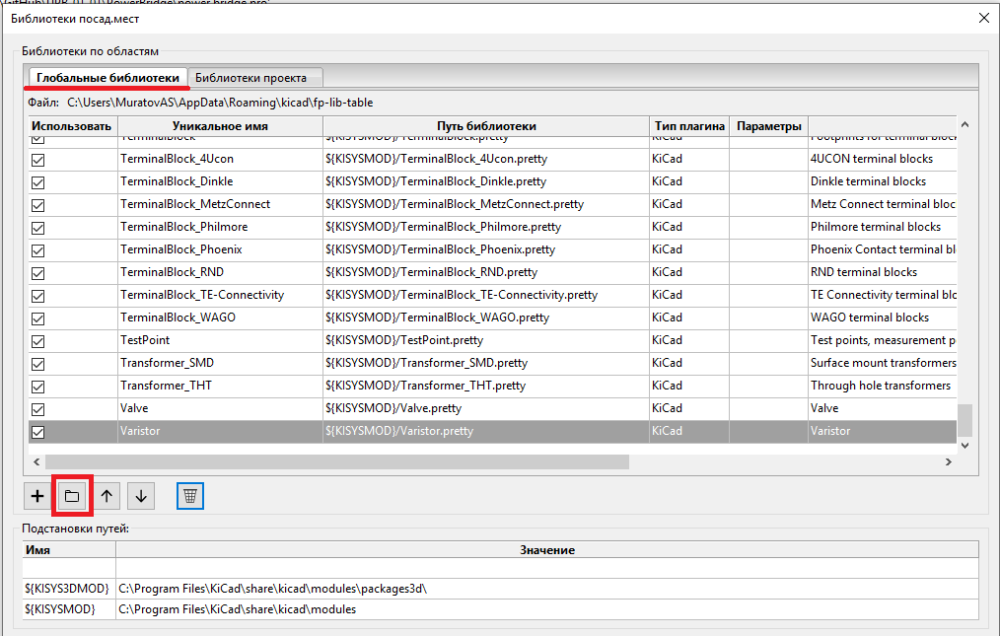
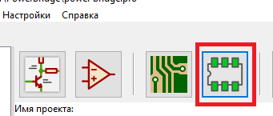
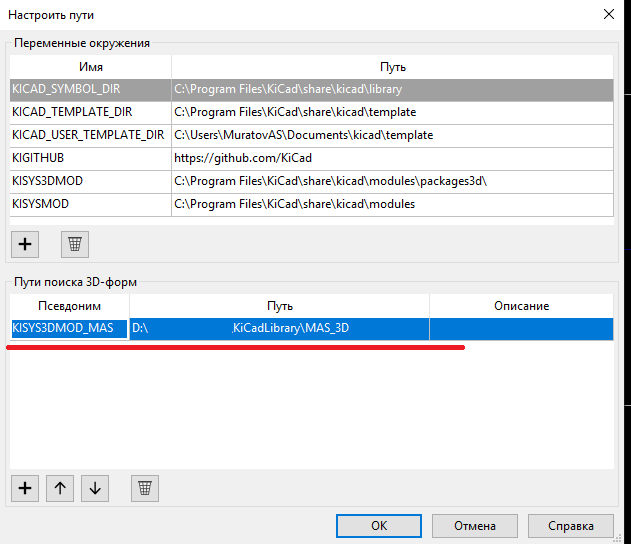

# Библиотека компонентов для KiCad
Данная библиотека является открытой и используется автором для работы, следовательно, постоянно пополняется новыми компонентами. Посадочные места для компонентов выполнены в полном соответствии с группой стандартов IPC. 

## Установка

Скачайте архив с библиотекой или клонируйте репозиторий к себе на локальный диск:

~~~ bash
git clone https://github.com/MuratovAS/KiCadLibrary
~~~

Все библиотеки состоят из четырёх файлов:

- Файлы с расширением .Lib - содержат УГО компонентов
- Каталог MAS_Package_std.pretty - содержит посадочные места для стандартных корпусов, например, LQFP-48 и подобные
- Каталог MAS_Package_nostd.pretty - содержит посадочные места для нестандартных компонентов, например, разъемов

Для установки нужной библиотеки откройте KiCad и перейдите в подпункт настроек:

Начнем с подключения библиотеки компонентов. Жамкаем на указанные кнопки и добавляем все файлы из с расширением .Lib из скаченного репозитория.

Подобную операцию проворачиваем для библиотеки посадочных мест, только нашей целью будут каталоги  MAS_Package_std.pretty, MAS_Package_nostd.pretty.

В заключение подключим 3D модули, для наших компонентов. Как оказалось это не совсем тривиальная задача. Переходим в редактор посадочных мест:

Нам необходимо попасть в меню настройки путей, из окна редактора посадочный мест !!!

Создать новый путь для поиска 3D моделей на вашей машине.

# Шифр проекта

Небольшая заметка об именование проектов. 

## Синтаксис:

Шифр - NAME_NN_BB_VV_RR

- NAME - имя проекта
- NN (Node) - узел проекта
- BB (Board) - плата
    - где уровень - это номер платы сборки, отсчет начинается снизу. 
- VV (Version) - версия
- RR (Reserve) - резервное поле (default = 00)
