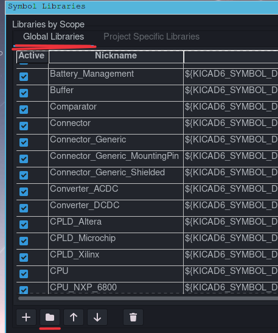

# Библиотека компонентов для KiCad
Данная библиотека используется автором для работы, постоянно пополняется новыми компонентами. Посадочные места для компонентов выполнены в полном соответствии с группой стандартов IPC. 

Mainline: `KiCad 6`

Структура библиотеки:

- `*.kicad_sym` - библиотека УГО компонентов
- `MAS_Package_std.pretty` - посадочные места для стандартных корпусов. Например, LQFP-48 и подобные
- `MAS_Package_nostd.pretty` - посадочные места для нестандартных компонентов, например, ZMPT107-1

## Установка:

Скачайте архив или клонируем репозиторий на локальный диск:

~~~ bash
git clone https://github.com/MuratovAS/KiCadLibrary
~~~

Для установки библиотеки откройте KiCad и перейдите в подпункт настроек:

Жмакаем на указанные кнопки и добавляем все файлы `*.kicad_sym`.

Подобную операцию проворачиваем для библиотеки посадочных мест, только нашей целью будут каталоги `MAS_Package_std.pretty`, `MAS_Package_nostd.pretty`.

В заключение подключим 3D модули. 
Создаем переменную `MAS_3DMODEL_DIR`, пропишем путь к каталоку `MAS_3DModel`.

# Подготовка к производству (jlcpcb)

## Gerber

Стандартная конфигурации:

- `Cu` - слой меди

- `Paste` - слой трафарета для нанесения паяльной пасты 

- `SilkS` - слои шелкография 

- `Mask` - слой маски 

- `Edge` - контур платы и фрезеровка 

## Drill Files

Стандартная конфигурации:

В результате получаем 2 файла сверловки для металлизированных и не металлизированных отверстий

## BOM

Пример правильно оформленного BOM

Обязательные столбцы:

- **Comment**
- **Designator**
- **Footprint**
- **LCSC part number**

Для более удобного экспорта, необходимо подключить шаблон

~~~bash
xsltproc -o "%O.csv" "ВАШПУТЬ/KiCadLibrary/Templates/bom2grouped_csv_jlcpcb.xsl" "%I"
~~~

## Pick and Place files

Файл CPL должен быть с генерированый из редактора печатной платы, щелкните Файл -> Файлы для производства -> Файл позиций посадочных мест (.pos) и экспортируйте файл со следующими настройками.

Затем переименовать столбцы:

- **Ref** -> **Designator** 
- **PosX** -> **Mid X**
- **PosY** -> **Mid Y**
- **Rot** -> **Rotation** 
- **Side** -> **Layer**

~~~bash
sed -i 's/Ref/Designator/g' *.csv
sed -i 's/PosX/Mid X/g' *.csv
sed -i 's/PosY/Mid Y/g' *.csv
sed -i 's/Rot/Rotation/g' *.csv
sed -i 's/Side/Layer/g' *.csv
~~~

Пример результирующего файла:

TODO:
- [ ] исправить модель UDFN14_5
- [ ] исправить модель NLC453232T