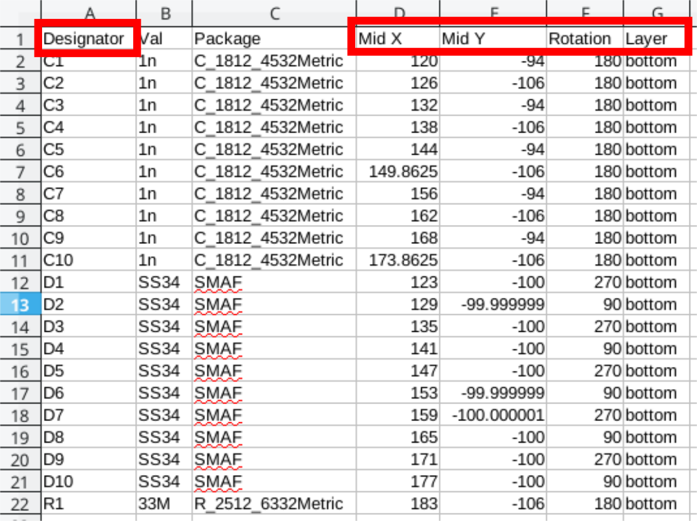

# Библиотека компонентов для KiCad
Данная библиотека является открытой и используется автором для работы, следовательно, постоянно пополняется новыми компонентами. Посадочные места для компонентов выполнены в полном соответствии с группой стандартов IPC. 

## Установка:

Скачайте архив с библиотекой или клонируйте репозиторий к себе на локальный диск:

~~~ bash
git clone https://github.com/MuratovAS/KiCadLibrary
~~~

Все библиотеки состоят из четырёх файлов:

- Файлы с расширением .Lib - содержат УГО компонентов
- Каталог MAS_Package_std.pretty - содержит посадочные места для стандартных корпусов. Например, LQFP-48 и подобные
- Каталог MAS_Package_nostd.pretty - содержит посадочные места для нестандартных компонентов, например, разъемов

Для установки нужной библиотеки откройте KiCad и перейдите в подпункт настроек:

Начнем с подключения библиотеки компонентов. Жамкаем на указанные кнопки и добавляем все файлы из с расширением .Lib из скачанного репозитория.

Подобную операцию проворачиваем для библиотеки посадочных мест, только нашей целью будут каталоги MAS_Package_std.pretty, MAS_Package_nostd.pretty.

В заключение подключим 3D модули, для наших компонентов. Как оказалось это не совсем тривиальная задача. Переходим в редактор посадочных мест:

Нам необходимо попасть в меню настройки путей, из окна редактора посадочных мест !!!

Создать новый путь для поиска 3D моделей на вашей машине.

------

# Подготовка к производству (jlcpcb)

## Gerber

Выберите File -> Plot из меню

Выбираем необходимые слои и конфигурацию:

- Cu - слой меди

- Paste - слой трафарета для нанесения паяльной пасты 

- SilkS - слои шелкография 

- Mask - слой маски 

- Edge - контур платы и фрезеровка 

Рекомендованные расширения файлов:

## Drill Files

В результате получаем 2 файла сверловки для металлизированных и не металлизированных отверстий

## BOM

Пример правильно оформленного BOM

Обязательные столбцы:

- **Comment**
- **Designator**
- **Footprint**
- **LCSC part number**

Для более удобного экспорта, необходимо подключить шаблон

~~~bash
xsltproc -o "%O.csv" "ВАШПУТЬ/GitHub/KiCadLibrary/Plugins/bom2grouped_csv_jlcpcb.xsl" "%I"
~~~

## Pick and Place files

Файл CPL должен быть сгенерирован из редактора печатной платы, щелкните Файл -> Файлы для производства -> Файл позиций посадочных мест (.pos) и экспортируйте файл со следующими настройками.

Затем переименовать столбцы:

- Ref -> Designator 
- PosX -> Mid X 
- PosY -> Mid Y 
- Rot -> Rotation 
- Side -> Layer

Пример результирующего файла:

------

# Шифр проекта

Небольшая заметка об именование проектов. 

## Синтаксис:

Шифр - NAME_NN_BB_VV_RR

- NAME - имя проекта
- NN (Node) - узел проекта
- BB (Board) - плата
- где уровень - это номер платы сборки, отсчет начинается снизу. 
- VV (Version) - версия
- RR (Reserve) - номер листа схемы (default = 00)

------

# Список поставщиков компонентов

Позиции расставлены в порядке приоритетов

- www.promelec.ru
- www.chipdip.ru
- www.lcsc.com
- www.elitan.ru
