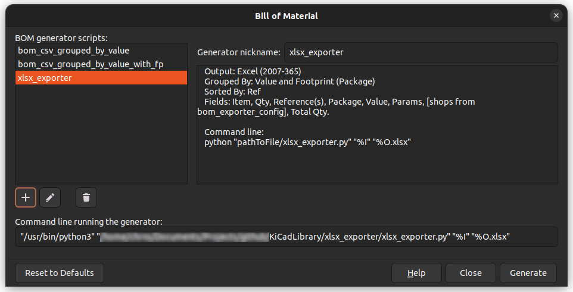
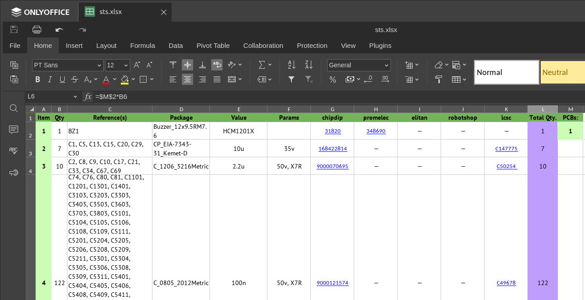

# Импортер для KiCAD в Excel

Для работы необходим пакет `xlsxwriter`:

```bash
sudo pip3 install xlsxwriter
```

Для кастомизации исправьте файл `bom_exporter_config.py`.

```python
DOCUMENT_COMPONY_NAME: str = 'Horns and Hoovers'
FONT_NAME: str = 'PT Sans'
FONT_SIZE: int = 12
PRIMARY_COLOR: str = '#74B357'
SECONDARY_COLOR: str = '#CCFDB6'
OPTIONAL_COLOR: str = '#A5ECFF'
EXCHANGEABLE_COLOR: str = '#FFE277'
TOTAL_COLOR: str = '#BE9DFC'
SHOPS: dict = {
    'chipdip': 'https://www.chipdip.ru/search?searchtext={}',
    'promelec': 'https://www.promelec.ru/product/{}/',
    'elitan': 'https://www.elitan.ru/price/item{}',
    'robotshop': 'https://shop.robotclass.ru/index.php?route=product/product&product_id={}',
    'lcsc': 'https://lcsc.com/search?q={}'
}
```

Запуск через стандартное окно BOM-генератора.



Пример вывода:



